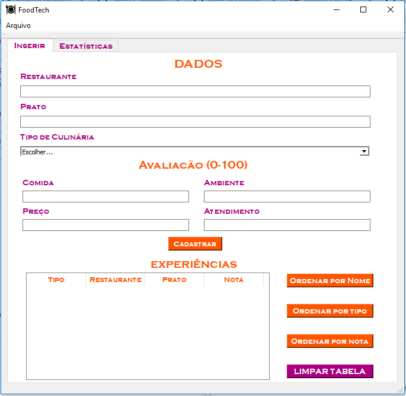

# FoodTech

### Projeto desenvolvido em [QT Creator](http://www.qt.io) para gerenciar Experiências Gastronômicas.

Essa aplicação além de cadastrar dados de experiências gastronômicas como o tipo de culinária, o restaurante e o nome do prato, também calcula a nota que a experiência obteve a partir de quatro avaliações.

A tela inicial do FoodTech é dividida em três partes: a primeira é a parte em que o usuário cadastra os dados; a segunda o usuário avalia a experiência que ele viveu de acordo com os critérios; a terceira é a parte de exibição da experiência, em que está contida a tabela com os dados e a nota final obtida com as avaliações:

A segunda tela contém algumas estatísticas das experiências vividas e cadastradas, como a melhor e a pior:

# Manual de Utilização

### O FoodTech possui uma interface simples e fácil de usar, para oferecer a melhor experiência ao usuário. Confira aqui todos os detalhes de como utilizar:

### Cadastrando uma nova Experiência Gastronômica

Vamos começar cadastrando uma nova experiência. Para isso o usuário precisa: escrever o nome do Restaurante e do Prato e escolher o Tipo de culinária: 

Após isso, seguimos para a parte do cadastro das avaliações. Para isso o usuário precisa entender quais são os critérios de avaliação e como atribuir as notas. 

O primeiro critério é a comida. O usuário deve avaliar a comida em termos de sabor e apresentação atribuindo a ela uma valor de 0 a 100.

O segundo critério é o preço. O usuário deve inserir um valor de 0 a 100 que reflita o quanto ele ficou satisfeito com o preço da comida sendo 0 -> muito insatisfeito e 100 -> muito satisfeito.

O terceiro critério é o ambiente. O usuário deve avaliar o ambiente seguindo a mesma linha de raciocínio da avaliação anterior, sendo 0 -> muito insatisfeito e 100 -> muito satisfeito.

O quarto e último critério é o atendimento. O usuário deve avaliar o atendimento seguindo a mesma linha de raciocínio da avaliação anterior, sendo 0 -> muito insatisfeito e 100 -> muito satisfeito.

O último passo é apertar no botão "Cadastrar".

### Visualizando a Experiência Gatronômica

Após cadastrar, a experiência será exibida em uma tabela, que terá 4 colunas: Tipo; Restaurante; Prato e Nota. 

A nota obtida pelo restaurante é uma média ponderada envolvento as quatro avaliações. Essa média é obtida de acordo com o peso das avaliações, que são: 

Comida: peso 4
Preço: peso 2
Ambiente: peso 2
Atendimento: peso 2

Todos esses critérios são fundamentais para determinar se a experiência foi agradável ou desagradável.

### Ordenando as experiências

Após o usuário inserir suas experiências, as linhas da tabela estarão ordenadas de acordo com a ordem de cadastro:

O usuário pode ordenar as experiências por três critérios:

1. Ordenando por Nome
Ao clicar no botão "Ordenar por Nome", as linhas da tabela serão ordenadas pelo nome do restaurante (ordem alfabética):

2. Ordenando por Tipo
Ao clicar no botão "Ordenar por Tipo", as linhas da tabela serão ordenadas pelo tipo de culinária (ordem alfabética):

3. Ordenando por Nota
Ao clicar no botão "Ordenar por Nota", as linhas da tabela serão ordenadas pela nota final (ordem decrescente):

### Checando as Estatísticas

Para ter acesso às estatísticas, o usuário deve ir até a segunda aba e clicar no botão "Atualizar Estatísticas":

Após clicar no botão, o usuário terá acesso à melhor e à pior experiência. Sendo a melhor, a experiência que obteve maior nota; e a pior, a experiência que obteve a pior nota:

### Editando um item da Tabela

Se o usuário quer editar um item da tabela, basta clicar duas vezes sobre o item que deseja editar:

Após clicar em "OK" o item será substituido:

Além de substituido, quando o usuário for checar as estatísticas e clicar em "Atualizar Estatísticas", o item estará substituído também:

### Salvando a Tabela

Se o usuário deseja salvar as experiências, basta abrir a aba "Arquivo" no canto supeior esquerdo e clicar em "Salvar":

Após isso, basta escolher a pasta onde quer salvar e escrever um nome para o arquivo:

### Limpando a Tabela

Para limpar a tabela e começar a cadastrar novas experiências, basta clicar no botão "Limpar" e a tabela ficará em branco novamente.

### Abrindo uma Tabela

Se o usuário deseja abrir uma tabela já existente, basta abrir a aba "Arquivo" no canto supeior esquerdo e clicar em "Abrir Arquivo":

Após isso, basta escolher o arquivo que deseja abrir.

# Agora é só começar a usar! 

